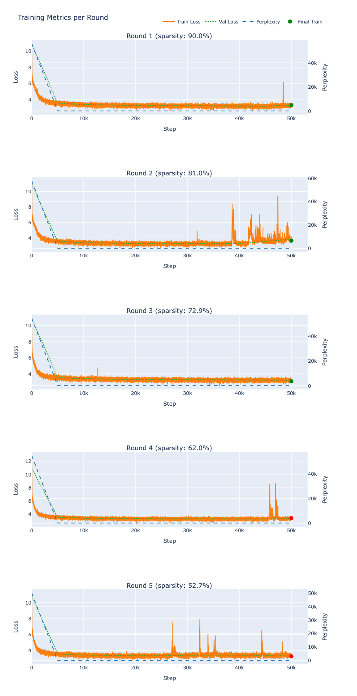
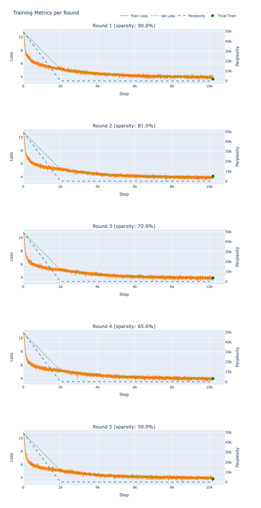

# This is a subfolder for Lottery Winning Tiket Hypothesis implementation using GPT2

Prerequisite of this repo is ```requirements.txt``` installation.

The location of Super Weights of the current model is hard-coded (global vars in lines 369-371). Therefore, ```/super_weights/find_sw.sh``` should be run beforehand and location has to be copied from the output.


# Set up of the experiment

## Reference paper

https://arxiv.org/pdf/1803.03635


## Structure of the directory

```LWH/
├── /experiment_results-> separate folders-experiments created during run. (+)
├── /plots   -> png files with summaries per experiment
├── /src         -> source code, where the logic is defined
├── func_train.sh   -> main runnable script, adapted for HPC use   
└── README.md
```

(+)  Have .csv for each round (training cycle) stats + losses/perplexity.
## The flow

The idea is to check whether Super Weight [refer to [\[super_weights\](../README.md)\]](../super_weights/README.md) survives pruning introduced by Lottery Winning Ticket Algorithm. The latter is an ___N__ iterative training procedure with pruning (zeroing out based on the criterium) after the last training step. The procedure repeats with now sparser network, so pruning is presered in the next round. We want to see how much of pruning the SW, which is described to be extremely important for the generative nature of the network, can survive.

## The loop

The LTH pruning loop, in plain steps:

- Initialize & do first prune & train a dense network from random weights until it converges (somehow at least)
- Prune away a fraction of the network (if not 1 round) 
- Rewind the surviving connections back to their original random values initialisation.
- Retrain just that sparse subnetwork
- When iterative approach instead of one-shot:  repeat - prune again, rewind, retrain.

## The parameters important in this study

- *Number of rounds*: number of iterative training, together with *pruning percentage* forms the sparsity level. 
- *Pruning percentage*: amount of weights, threshold, to crop out based on the lowest absolute value across all layers all values.
- *SW location* : hard-coded location of SW in the down_projection matrix of MLP block (mostly 2nd Transformer Block)
- *max_iter*: number of steps inside each LWH iteration.
- *seed*: random seed.
- *init_type*: baseline - original gpt2 init, Xavier..
- *OUTPUT_DIR*: the output directory, same as name of the run (experiment, refer to the further table)
- *lr* : learning rate. Not really imporant now, but may be of use later. Default to GPT2 docu.

## Current setup

__Training with 4 GPU's H100!__

- *Number of rounds* fixed to 5.
- *Max_iters*, *init_type*,  and *prune_percentage* -> the changable parameters that will help us answer the questions about the necessity of convergence, Xavier initialization and just the maximal sparsity.
- Training tokens per step: 12 (batch size) *1024 (block size) *20 (grad accumulation) *4 (gpu's)= 245k*4 =983k -> for 10 * 10^9 openweb train gives 10200 steps for one epoch

## When running...

Before doing:

``` sbatch func_train.sh``` 

__! Check:__

-  SW location in your model (func_train.sh 13-18 lines). At the moment GPT2-124M SW is used. 
- .env file is available at the root of the repository. Mlflow varaibles have to be set up there.
- venv universal-ner is created with requirements
- line 40 of .sh -> change to your path of the repository!!!

## During the run

Refer to 2 .log files (err and out) created and refreshed in /slurm_out.

## Core Questions to Ask and Answer
###  Mask Stability of Super Weights (SW):

    - At what sparsity levels and retraining budgets (steps per round) do SW consistently survive pruning?

    - How does initialization (original pre-trained vs. Xavier vs. Kaiming) affect SW retention?

### Sparsity–Performance Trade-off:

    - How does model quality (e.g. validation perplexity or downstream task accuracy) degrade as you increase sparsity with and without SW preservation?

    - Is there a “sweet spot” where you get high sparsity with minimal performance loss?

### Pruning Schedule Effects:

    - One-shot vs. iterative pruning: does smoothing the schedule (e.g. gradual 5% per round up to 20%) help protect SW?

    - Global vs. layerwise magnitude pruning: which better preserves SW?

### Retraining Budget:

    - How do different numbers of retraining steps (1 k, 3 k, 5 k, 10 k, 20 k) per round influence both final sparsity and SW survival?

    - Does a learning-rate schedule (warmup + decay) improve mask recovery?

### Statistical Robustness:

    - How much run-to-run variance is there? (repeat each key setting 3–5× with different seeds)

    - Are the observations significant?


# Experiments Table


| Exp ID | Init. Scheme    | Steps/Round | Pruning % (global) | Schedule                         | Pruning Type        | Seeds | Key Outcome Tracked                   | Notes / Purpose                       |
|:------:|:----------------|:------------|:------------------:|:---------------------------------|:--------------------|:------|:--------------------------------------|:---------------------------------------|
| A1     | Pre-trained     | 3 k         | 10 %               | 5× constant                      | Global magnitude    | 3     | SW survival per round; val. perplexity | Baseline                               |
| A2     | Pre-trained     | 3 k         | 20 %               | 5× constant                      | Global magnitude    | 3     | SW survival per round; val. perplexity | Baseline                               |
| B1     | Pre-trained     | 10 k        | 10 %               | 5× constant                      | Global magnitude    | 3     | SW survival per round; val. perplexity | Baseline                               |
| B2     | Pre-trained     | 10 k        | 20 %               | 5× constant                      | Global magnitude    | 3     | SW survival per round; val. perplexity | Baseline                               |
| C1     | Xavier init     | 10 k        | 10 %               | 5× constant                      | Global magnitude    | 3     | SW survival per round; val. perplexity | observed no SW pruned             |
| C2     | Xavier init     | 10 k        | 20 %               | 5× constant                      | Global magnitude    | 3     | SW survival per round; val. perplexity | observed no SW pruned             |
| D1     | Pre-trained     | 10 k        | 5 → 10 → 15 → 20 %  | Gradual (increasing each round)  | Global magnitude    | 3     | SW survival; performance curve         | Test smoother schedule                 |
| D2     | Pre-trained     | 10 k        | 5 → 10 → 15 → 20 %  | Gradual (increasing each round)  | Layerwise magnitude | 3     | SW survival; performance curve         | Compare global vs. per-layer           |
| F1     | Xavier init     | 20 k        | 20 %               | 5× constant                      | Global magnitude    | 3     | SW survival; val. perplexity            | Test larger budget                     |
| G1     | Pre-trained     | 10 k        | 15 %               | 5× constant                      | Global magnitude    | 3     | SW survival per round; val. perplexity | Intermediate sparsity                  |
| H1     | Xavier init     | 10 k        | 10 %               | 5× constant + LR warmup/decay    | Global magnitude    | 3     | SW survival; val. perplexity            | Test effect of LR schedule             |
| I1     | Pre-trained     | 10 k        | 20 %               | One-shot at start                | Global magnitude    | 3     | SW survival; val. perplexity            | Contrast iterative vs. one-shot pruning |
| J1     | pre-trained     |    50k     | 10%                   |5 * constant              | global magnitude | 3 | SW survival; val. perplexity   |
| M2 | xavier | 50k | 20%| 7 * constant | same..
# Legend:

Steps/Round: number of training steps between pruning rounds

Schedule: “5× constant” means prune by the stated % each of 5 rounds; “Gradual” means increasing % each round

LR schedule: e.g. 1 k warmup, cosine decay

# Interpretation of some results


**A1** and **A2** are the experiment with small amount of training and baseline initialization. The only difference is the pruning level.

**A1** for 2 seeds:

](plots/A1_seed0_new.png)
](plots/A1_seed1.png)

**A2** for 1 seed:

](plots/A2_seed2.png)


Experiment of group B introduce 10k training (1 epoch)

**B1**
](plots/B1_seed0.png)

**B2** (later, but shows no prune of SW)

No Xavier, just baseline, experiments showed us pruning everywhere except B1. 
Gives first understanding the amount of convergence, steps, is not a priority. Pruning happens or not randomly.

**J1**


More training showed to potential in SW survival.

That shows us that amount of training is not sufficient condition for SW to be preserved in case of GPT2 standard initialization.


**Introducing the Xavier init** the view changes completely - 3k or 10k, 10 or 20 % of prune does not change the fact of SW survival 

**C1**

](plots/C1_seed2.png)

**C2**

](plots/C2_seed2.png)


### What is the difference between baseline init and Xavier?

Xavier:

- Chooses the initial random weights based on the number of inputs and outputs for each layer.

 - By scaling the randomness to the layer’s size, it keeps the magnitudes of activations and gradients roughly the same as you go deeper.
This helps avoid signals that grow too large or shrink toward zero during training.

GPT2 original:

- Gives every weight a small random value drawn from the same narrow distribution, no matter how big or small the layer is.
- Doesn’t adjust per layer; it uses a single standard deviation (0.02) for all weight matrices.
- Relies on LayerNorm immediately after each layer to normalize and re-scale activations, so you don’t need to tune the initial scale yourself.


### CURRENT CONCLUSION

SW preservation is possible only with Xavier initialiation.

For additional information more experiments has to be run.