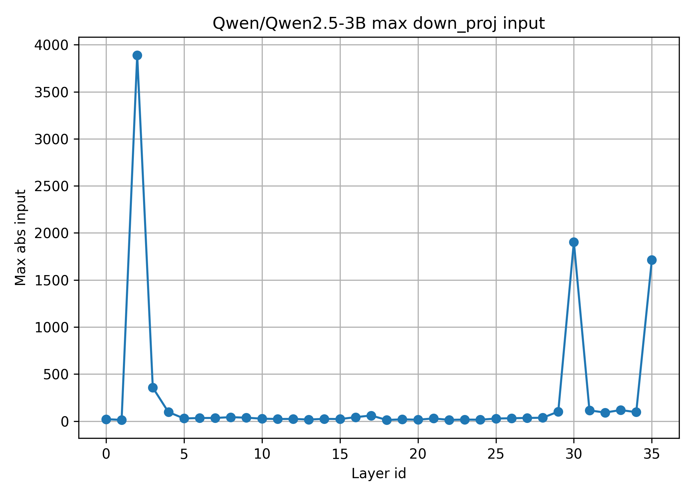
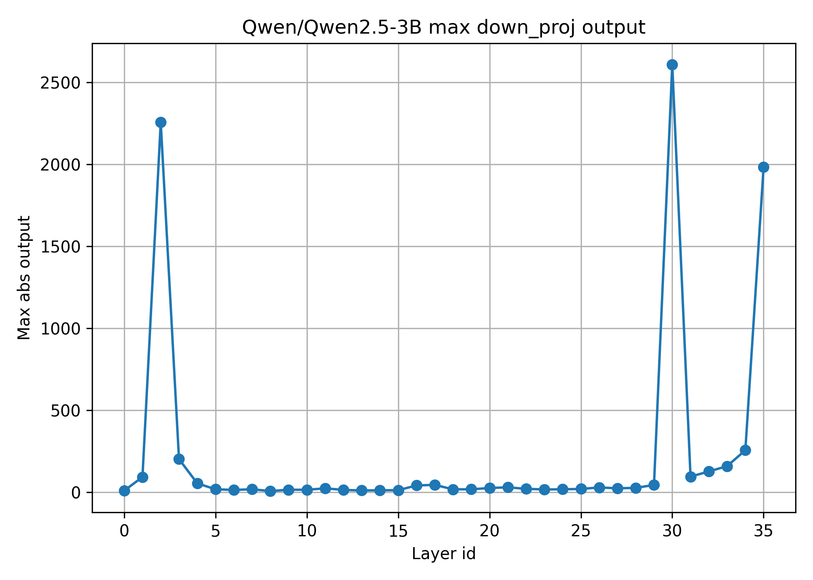
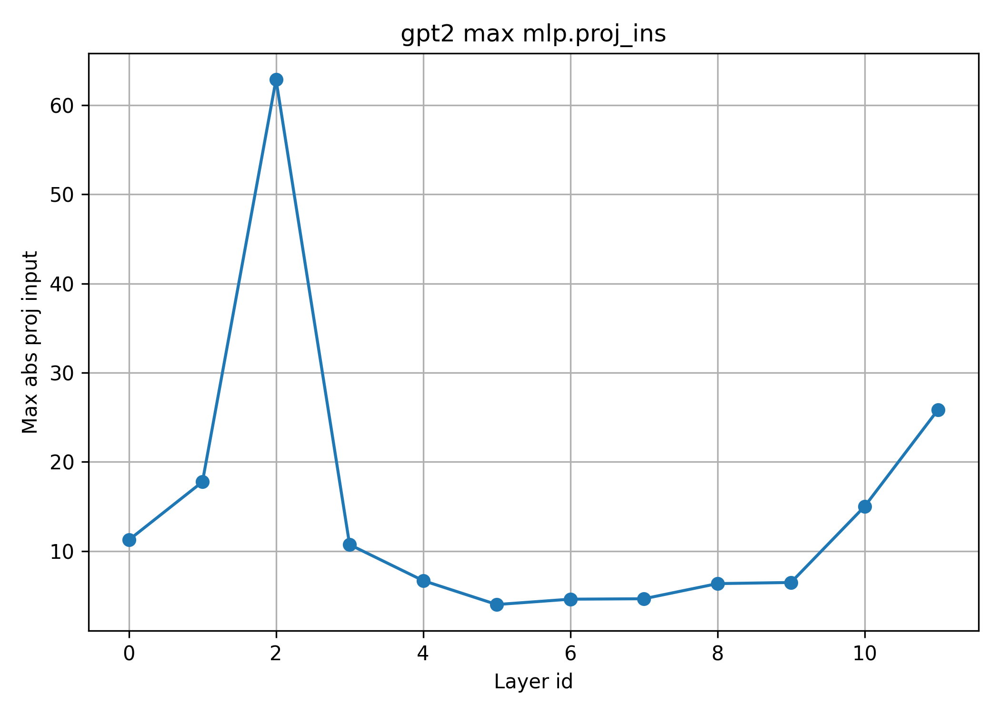
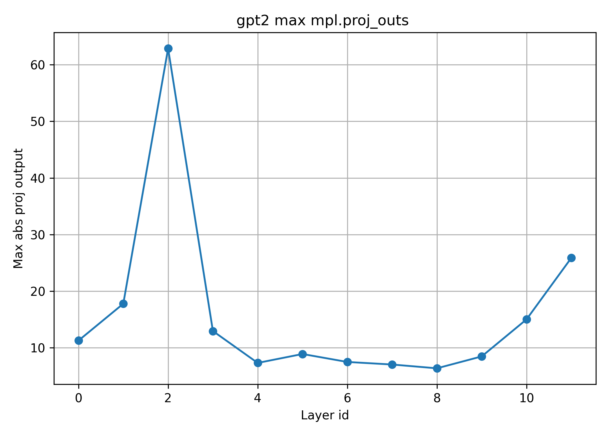

# Super Weight Location Search Directory


This repository analyzes transformer models to identify "super weights" — highly influential weights in MLP down projection layers — and measures their impact on perplexity. The paper suggests that adding some pruning to this particular weight in already fully trained model can soar the perplexity significantly - basically killing the models ability to generate.

### Reference paper

https://arxiv.org/abs/2411.07191


### Features

- Loads a transformer model (Qwen2.5-3B/GPT2 )
- Hooks into MLP `down_proj` layers to log activations
- Identifies top activation channels and "super weights"
- Measures perplexity before/after zeroing out super weights
- Saves plots of max activations as PNGs


### Structure

```super_weights/
├── /plot_outputs -> plots created during the run of .sh file
├── /slurm_out   -> .err and .out files created during HPC job run
├── /src         -> source code, where the logic is defined
├── find_sw.sh   -> main runnable script, adapted for HPC use                     
└── README.md
```


### Usage

1. For finding a SW one should run ```sbatch find_sw.sh```, make sure to specify the correct  ```--model_name``` parameter.At the moment only ``` gpt2``` OR ```Qwen/Qwen2.5-3B ``` are supported. 

2. The slurm job output will reside at ```/slurm_out```. The plots for down projection layers inputs/outputs across all the Transformer Blocks are stored at ```/outputs```

!Note: create ```/cache/huggingface/transformers``` in root dir of this project. In load_gpt_pretrained.py we point out this as the dir for cache. 

### About GPR 2 usage

GPT2 model is using the architecture defined by our config from scrape ([nanogpt2](../gpt2/nanoGPT)), but for SW finding we apply pretrained weights which we pull from HF. The weights are applied on our user-defined architecture,  with tricks to adapt the layer names (credit to A Karpaty). The linking file that utilizes the GPT2 repo is ```load_gpt_pretrained.py```

### Results of the study

#### Qwen3.5-3B

As suggested in the paper, the Super Weight has to be found in the early Trasformer block (0-2), specifically in the MLP part, Down-Projection Layer.

During the run, forward pass with hooks of the activations of the Down-Projection layer, we collect the greatest by absolute magnitude values of the in/out activations to mlp.down_proj in each block and plot it. For originally suggested model, Qwen2.5-3B, the results are as follows:




It is clearly seen that the block number 2, mlp.h.2, contains the greatest value. 

Based on the coordinates of the maximum in/ out activations coordinates ((n_in, c_in),(n_out, c_out)) of that block number 2 we can determine the location of the SW in mlp.down_proj as W[c_outs, c_in].

For Qwen SW is located at SW is at (318, 3189).
```
Original perplexity: 7.219

Zeroing super-weight at layer 2, coords (318, 3189)

Original weight value: -0.550781

Perplexity after zeroing super-weight: 9.188

Perplexity change: 1.969 (27.3%)
```

#### nanoGPT2-124M

The main target in this repo is to use nanoGPT2 for model architecture definition
(as it is smaller and trainable from scratch in adequate amount of time) locate the SW in it for further study of whether they are part of different research approaches to the most important regions of the model.

The SW is in the 2 block. Check out the output of the slurm job ```super_weights/super_weights/slurm_out/checkmodel_392717.out```






The location is (447, 666), 'superweight_value': 15.069.

Original perplexity: 25.987

Perplexity after zeroing super-weight: 25.985

Perplexity change: -0.002 (-0.0%)

No real change. The hypothesis of the paper does not really fully capture the nature of some models?